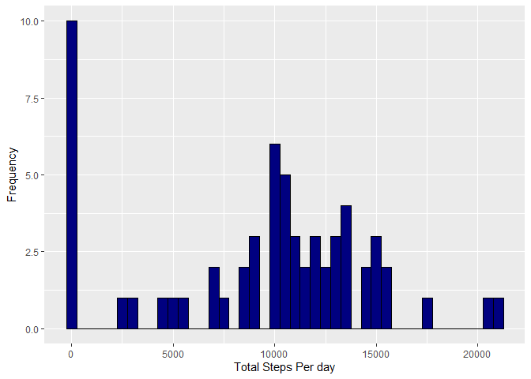
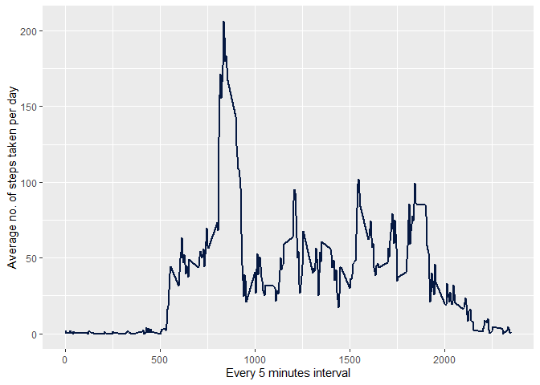
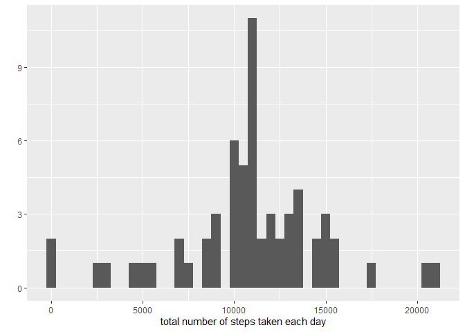

Reproducible Research: Assessment 1
===================================

This assignment makes use of data from a personal activity monitoring
device. This device collects data at 5 minute intervals through out the
day. The data consists of two months of data from an anonymous
individual collected during the months of October and November, 2012 and
include the number of steps taken in 5 minute intervals each day.

Loading and preprocessing the data
----------------------------------

``` r
library(ggplot2)
activity<-read.csv("activity.csv")
```

What is mean total number of steps taken per day?
-------------------------------------------------

``` r
totalStep<-aggregate(steps~date,activity,sum,na.action = na.pass)
totalStep[is.na(totalStep)]<-0
g<-ggplot(totalStep, aes(x=steps))
g+geom_histogram(binwidth = 500,color="black",fill="navy blue")+
    xlab("Total Steps Per day")+
    ylab("Frequency")
```



``` r
# Mean of total steps per day
mean(totalStep$steps)
```

    ## [1] 9354.23

``` r
# Median of total steps per day
median(totalStep$steps)
```

    ## [1] 10395

What is the average daily activity pattern?
-------------------------------------------

``` r
totalStep1<-aggregate(steps~interval,activity,mean)

g<-ggplot(totalStep1,aes(x=interval,y=steps))
g+geom_line(colour="#051841",size=1)+
    xlab("Every 5 minutes interval")+
    ylab("Average no. of steps taken per day")
```



For calculating the 5-minute interval that contains the maximum number
of steps

``` r
totalStep1[which.max(totalStep1$steps),]
```

    ##     interval    steps
    ## 104      835 206.1698

Imputing missing values
-----------------------

For counting the number of missing values

``` r
sum(is.na(activity))
```

    ## [1] 2304

For removing the missing values using 5 minutes interval mean

``` r
averages <- aggregate(x = list(steps = activity$steps), by = list(interval = activity$interval),FUN = mean, na.rm = TRUE)

fill.value <- function(steps, interval) {
    filled <- NA
    if (!is.na(steps)) 
        filled <- c(steps) else filled <- (averages[averages$interval == interval, "steps"])
        return(filled)
}
activityCopy <- activity
activityCopy$steps <- mapply(fill.value, activityCopy$steps, activityCopy$interval)
```

Histogram of the total number of steps taken each day

``` r
total.steps <- tapply(activityCopy$steps, activityCopy$date, FUN = sum)
qplot(total.steps, binwidth = 500, xlab = "total number of steps taken each day")
```



``` r
mean(total.steps)
```

    ## [1] 10766.19

``` r
median(total.steps)
```

    ## [1] 10766.19

Mean and median values are higher after imputing missing data. The
reason is that in the original data, there are some days with steps
values NA for any interval. The total number of steps taken in such days
are set to 0s by default. However, after replacing missing steps values
with the mean steps of associated interval value, these 0 values are
removed from the histogram of total number of steps taken each day.

Are there differences in activity patterns between weekdays and weekends?
-------------------------------------------------------------------------

Create a new factor variable in the dataset with two levels – “weekday”
and “weekend” indicating whether a given date is a weekday or weekend
day.

``` r
weekday.or.weekend <- function(date) {
    day <- weekdays(date)
    if (day %in% c("Monday", "Tuesday", "Wednesday", "Thursday", "Friday")) 
        return("weekday") else if (day %in% c("Saturday", "Sunday")) 
            return("weekend") else stop("invalid date")
}
activityCopy$date <- as.Date(activityCopy$date)
activityCopy$day <- sapply(activityCopy$date, FUN = weekday.or.weekend)
```

Make a panel plot containing a time series plot (i.e. type = “l”) of the
5-minute interval (x-axis) and the average number of steps taken,
averaged across all weekday days or weekend days (y-axis).

``` r
averages <- aggregate(steps ~ interval + day, data = activityCopy, mean)
ggplot(averages, aes(interval, steps)) + geom_line() + facet_grid(day ~ .) + 
    xlab("5-minute interval") + ylab("Number of steps")
```


